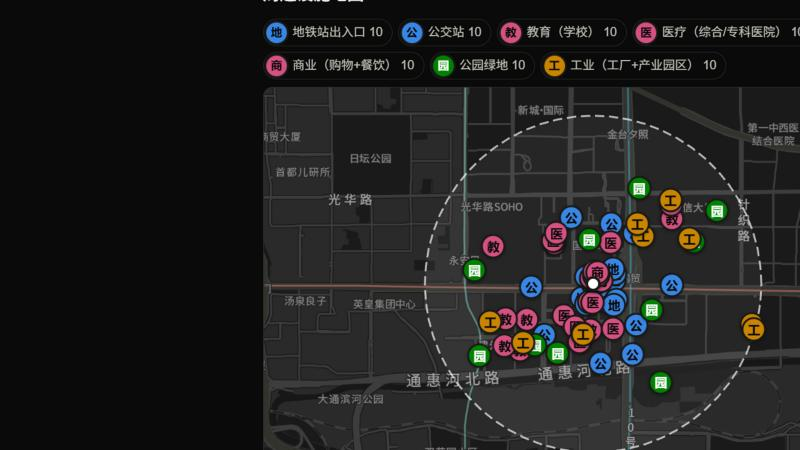
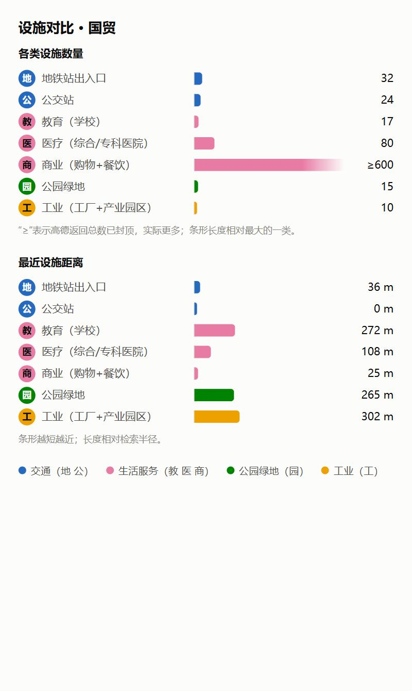
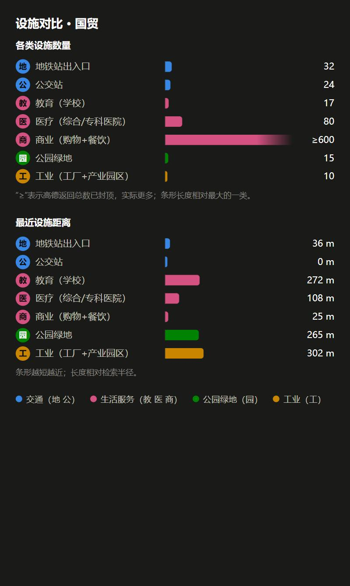

# 场地分析 Agent

输入北京的一个地址，自动检索周边 1 km 的设施，由大模型撰写学术风格的场地分析简报，并由**代码逐个校验简报中的数字**。

面向建筑与城市设计专业的学生：做课程作业前，先快速获得一份带数据来源的场地概况。

**▶ 在线体验版（可输入任意北京地址，实时生成）：** https://site-analysis-agent-m6lm-livid.vercel.app

**▶ 静态演示（预先生成的真实结果，点开即看，网络不佳时使用）：** https://dengzishuo19.github.io/site-analysis-agent/

> 在线体验版部署在 Vercel，**国内网络实测无法打开**（`vercel.app` 域名被屏蔽），需要海外网络；国内请直接看静态演示，它在国内实测可完整快速打开，交互地图也可正常使用。为保护接口额度，设有访问频率限制。

## 设计要点

大模型擅长写作，但不擅长数数，也可能编造数字。所以这个项目把职责拆开：

| 环节 | 谁来做 | 原因 |
|---|---|---|
| 地址转坐标、周边设施检索 | 高德 Web 服务 API | 国内数据全 |
| 计数、按距离排序、取最近设施 | **代码** | 大模型数数不可靠 |
| 把统计数据写成书面简报 | 大模型（DeepSeek） | 擅长写作 |
| 逐条核对简报里的断言 | **代码** | 事实由代码裁决，不交给模型 |

校验器核对三类断言：「设施名」必须存在于数据；名称后的距离必须属于这个设施；“某类别 N 处”的 N 必须等于该类别的数量；其余数字至少要出现在统计表里。为了让校验器认得出断言，提示词要求模型使用固定句式。校验不通过时，会带着具体的纠错信息让模型重写一次；仍不通过则在页面上标红警告，不会悄悄放行。

## 功能

- 输入北京地址，检索 7 类设施：地铁站出入口、公交站、教育、医疗、商业、公园绿地、工业
- 统计表 + 学术风格简报，每个结论标注依据的类别
- 数字校验（纯函数，带单元测试），失败重试一次，仍失败则如实标记
- 高德返回总数封顶时标注“≥”；地址不存在或不在北京时给出明确提示
- **交互地图**（高德 JS 地图）：标出周边设施与 1 km 范围，点击标记看详情，点击图例显示/隐藏类别
- **条形图**：各类设施数量与最近距离；浅色、深色自适应

### 可视化

配色按 [dataviz 技能](docs/tasks/007-visualization.md) 的方法计算：该色板最多只有 4 种颜色能同时通过“全配对”检查，而设施有 7 类，所以采用**复合编码**——颜色表示类型族（交通、生活服务、公园绿地、工业），标记里的单字表示具体类别（地、公、教、医、商、园、工），不靠颜色硬分。

| 地图（深色） | 图表（浅色） | 图表（深色） |
|---|---|---|
|  |  |  |

## 已知局限（如实说明）

- 数据是地图 POI 点位，**不等于用地性质**；地铁按出入口计数；分类存在噪音。
- 高德返回的总数在约 600 处封顶。
- **校验器只认得固定句式。**在固定句式下，对 24 份真实简报中的 766 个数字，全部被配对核对过（覆盖率 100%；此后新生成的简报偶尔有 1 个数字未配对，例如免责说明里泛指的“数量为 0 的类别”，它在统计表里，不算违规），六种篡改（改数量、改距离、互换距离、改设施名等）新版全部发现，旧版只发现 1 种。但这是对“按模板写出的文字”的度量：认不出的数字只核对是否出现在统计表里，不判违规，模型若换成校验器不认识的说法，仍可能漏过。
- 名称与距离的配对不区分类别：同名设施只要距离匹配任意一条记录即通过。
- 目前仅覆盖北京。
- 地图：高德在页面上**无法探测“域名未获授权”**（地图会空白而不报错），所以静态演示页只在白名单里的域名下加载交互地图，其余情况（双击打开文件、其他域名）直接显示截图。同一位置的密集标记会互相遮挡，需要放大查看。
- 地图缩放是高德原生功能，我在自动化环境里未能触发滚轮缩放，只验证了初始取景、图例开关和信息窗。

## 本地运行

需要 Node.js 20+，以及高德开放平台的 Web 服务 Key、Web 端（JS API）Key 和 DeepSeek API Key。

```bash
npm install
cp .env.example .env.local   # 然后在 .env.local 中填入你自己的 Key
npm run dev                  # 打开 http://127.0.0.1:3000（不要用 localhost，见下）
npm test                     # 运行单元测试
```

**本地必须用 `127.0.0.1` 访问**：高德的域名白名单不接受 `localhost`，而地图会按访问域名校验 Key。

**关于地图 Key：**Web 端（JS API）Key 会出现在浏览器里，这是它的工作方式，无法像其他 Key 那样藏在服务器里。它是一个独立的 Key（与 Web 服务 Key 分开），靠高德控制台里的**域名白名单**保护（`127.0.0.1`、GitHub Pages 域名、在线版域名）；白名单可以被非浏览器工具伪造，最坏的后果是有人消耗它的每日额度，不会产生费用。高德的服务条款规定：未购买技术服务许可时，所提供的 Key 与额度仅供短期、少量的测试使用——本项目是技术演示，请勿大量访问。

**排错：**若地图区域提示“脚本已加载但不可用”或“Key 格式不正确”，多半是环境变量里的 Key 带了多余字符（空格、换行、引号、变量名前缀）。高德在这种情况下不会报错，只会返回一个不定义 `AMap` 的脚本，页面上就是“脚本已加载但不可用”。代码会自动去掉首尾空白与引号，并要求 Key 是 32 位字母数字；重新填写环境变量并重新部署即可。

`.env.local` 已被 `.gitignore` 忽略，Key 只在服务端使用，不会出现在前端代码或返回结果中。生产环境还需要配置 `SIGNING_SECRET`（随机字符串，生成方法见 `.env.example`），缺少时所有页面和接口都会返回 500（安全失败，不会放行未签名的数据）。

## 公开部署的防护

在线版对所有人开放，背后消耗的是作者的接口额度，所以做了这些防护：

- **统计数据签名**：`/api/site` 返回的数据带 HMAC-SHA256 签名（30 分钟有效），`/api/report` 只接受验签通过的数据。别人无法伪造统计数据来滥用大模型，也无法借设施名称做提示词注入。
- **频率限制**：每个访问者每分钟、每天有上限，另有全站每日总上限，超限返回 429 并引导到静态演示。上限可用环境变量调整。
- **输入清洗**：地址限 60 个字符，拒绝换行与控制字符。
- **`/api/health` 在生产环境返回 404**；基础安全响应头。

**这套防护的边界：**限流数据存在进程内存里，在多实例的无服务器环境下每个实例各自计数，只是“尽力而为”，防不住有意的攻击。兜底靠 DeepSeek 预充值制（最坏情况是余额用完）和高德的每日额度；如果被滥用，下一步是把计数迁移到共享存储（如 Redis）。

## 项目结构

```
lib/amap.ts      高德接口封装（地理编码、周边搜索）
lib/stats.ts     设施统计（类别与分类编码在此配置）
lib/llm.ts       大模型调用封装（OpenAI 兼容格式，换模型只改环境变量）
lib/report.ts    简报生成 + 校验重试
lib/verify.ts    数字校验（纯函数）  ← 含 verify.test.ts
app/api/         site（统计）、report（简报）、health（连通性检查）
docs/index.html  静态演示页（由 scripts/build-demo.mjs 生成）
docs/tasks/      每个开发阶段的派工单与验收记录
```

## 开发过程

项目借助 AI 编程 Agent 完成：我提出需求、审阅设计并逐条验收。每个阶段先写派工单（背景、输入输出、不许改的文件、验收标准），完成后按验收标准核对并留下证据，记录保存在 [`docs/tasks/`](docs/tasks/)。开发中真实发现并修复的问题包括：

- 高德的 `sortrule=distance` 返回顺序并不严格按距离，导致统计表“最近设施”出错，改为多取并在代码中排序。
- 收紧提示词时，模型把规则里的数字抄进了简报，被校验器拦下；这是提示词缺陷，已修正。
- 校验器升级后第一次用真实数据测量，12 份里有 2 份被误判：模型写“以「国贸地铁站(公交站)」为中心，分析半径 1000 m”，中心地址恰好也是数据里的公交站，半径被当成它的距离。这是解析器缺陷，已修复，并补了回归测试；单元测试想不到这种情况，是真实数据测出来的。

## 数据来源与声明

设施数据来自[高德开放平台](https://lbs.amap.com/)，简报由 DeepSeek 生成。本项目仅作技术演示与学习，简报仅基于统计表，不构成任何规划或投资建议。
